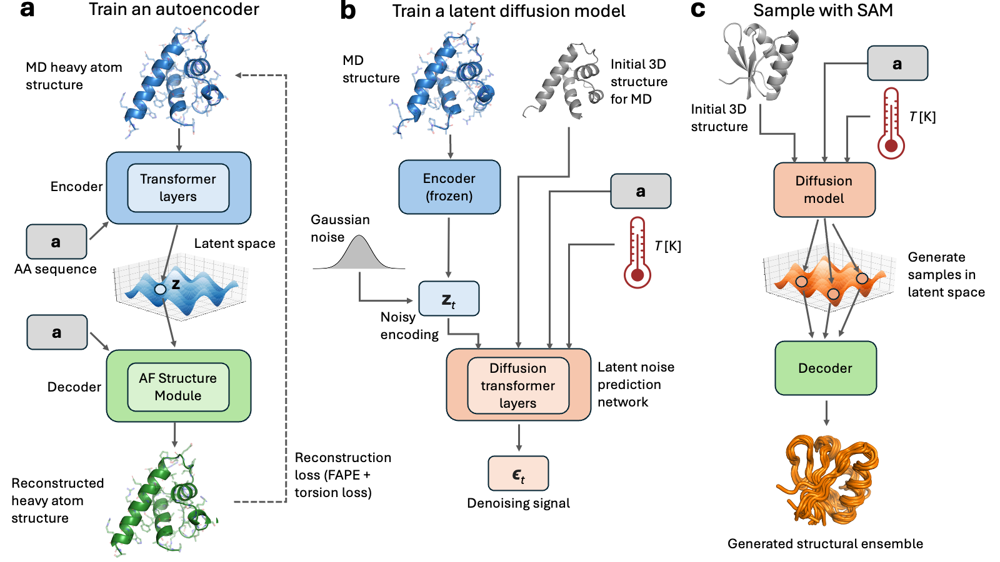

# SAM: latent diffusion model for protein structural ensemble generation

## About
Repository implementing [aSAM](https://www.biorxiv.org/content/10.1101/2025.03.09.642148v1) (atomistic Structural Autoencoder Model) in [PyTorch](https://pytorch.org). aSAM is a latent [diffusion model](https://en.wikipedia.org/wiki/Diffusion_model) for generating heavy atom conformations of proteins. The model was trained on datasets of molecular dynamics (MD) simulations from [mdCATH](https://github.com/compsciencelab/mdCATH) or [ATLAS](https://pubmed.ncbi.nlm.nih.gov/37986215/). Here we provide code for aSAM and weights of two models trained on these two datasets.

This repository mainly implements the inference phase of aSAM (panel **c** in the figure below). Given an input 3D structure provided as a PDB file (and optionally a temperature `T`), you can generate a 3D structural ensemble which should represent an MD ensemble observable in the training dataset of aSAM: 100 ns x 3 runs or 500 ns x 5 runs for ALTAS and mdCATH, respectively.



# 1 - Installation

## 1.1 - Local system
We provide a Linux-only package for running aSAM. Here is how to install it:

1. Clone the repository:
   ```bash
   git clone https://github.com/giacomo-janson/sam2.git
   ```
   and navigate to the root directory of the repository.

2. We recommend installing the aSAM package in a dedicated Python environment, for example a [Conda environment](https://docs.conda.io/projects/conda/en/latest/user-guide/tasks/manage-environments.html) or a [Python virtual environment](https://docs.python.org/3/library/venv.html). If you use Conda:
   ```bash
   # Create the environment.
   conda create --name sam2 python=3.10
   # Activate the environment.
   conda activate sam2
   ```
3. Optional (but recommended): if you want to use a GPU to speed up aSAM sampling, you may need to manually install PyTorch with CUDA. We have tested aSAM with PyTorch versions 1.13.1 to 2.6.0, higher versions should also work well. Make sure to choose a PyTorch version associated to a CUDA version compatible with your system. Check the PyTorch website [here](https://pytorch.org/get-started/locally/) and [here](https://pytorch.org/get-started/previous-versions/) for installation instructions. Note: if you skip this step, a PyTorch version will be installed automatically in the next step, but it may not include CUDA support depending on your system.
4. Install the `sam` Python library and its dependencies:
   ```bash
   pip install -e .
   ```

We tested the package on Python 3.10, but it should work more recent versions too. The entire installation process should take a few minutes at most.

# 2 - Usage: generate conformational ensembles

## 2.1 - Running locally

### 2.1.1 - mdCATH-based aSAMt
You can generate a structural ensemble of a protein via the `scripts/generate_ensemble.py` inference script. To run the mdCATH-based aSAMt model, the usage is:
```bash
python scripts/generate_ensemble.py -c config/mdcath_model.yaml -i examples/input/4qbuA03.320.pdb -o protein -n 24 -b 8 -T 320 -d cuda
```
Here is a description of the arguments:
* `-c`: configuration file for aSAMt. Use the default ones provided in the `config` directory of the repository.
* `-i`: initial PDB file. This represent the initial
* `-o`: output path. In this example, the command will save a series of output files named `protein.*`. The expected output is: (i) a DCD trajectory file storing the conformations you generated; (ii) a PDB file that you can use as topology for parsing the DCD file (this conformation is simply the first snapshot of the trajectory file).
* `-n`: number of conformations to generate. In this example we set it to 24, but depending on the application you may need more.
* `-b`: batch size used sampling.
* `-T`: simulation temperature (in units of Kelvin) at which to generate an ensemble.
* `-d`: PyTorch device for the aSAMt models. If you want to generate ensembles with large number of conformations, we recommend to use GPU support, via the `cuda` value here.

There are also other options that you can tweak. Use the `--help` flag to get the full list. Using a GPU, generating 250 conformations should not more than a few minutes.

### 2.1.2 - ATLAS-based aSAMc
In case you want to use the ATLAS-based aSAMc model, the command is:
```bash
python scripts/generate_ensemble.py -c config/atlas_model.yaml -i examples/input/6h49_A.pdb -o protein -n 250 -b 8 -d cuda
```

Note that this model is not conditioned on temperature, therefore any temperature input will be ignored.

### 2.1.3 - Automatic download of aSAM weights
The first time you will use the `scripts/generate_ensemble.py` script, it will automatically download aSAM weights from a [GitHub release](https://github.com/giacomo-janson/sam2/releases/tag/data-1.0). The files are pretty large (~ 1 GB for the ATLAS and mdCATH models each), so make sure to have enough storage space. By default, the files will be placed in the `$HOME/.sam2/weights` directory, which will be automatically created. If you want to change their download location, change the `SAM_WEIGHTS_PATH` environmental variable before running the script.

## 2.2 - Notes on aSAM input
📝 **Input PDB structure**: The only required input of this aSAM version is a PDB file. You can only provide PDB files with the following characteristics:
* Single chain PDB file.
* Single model PDB file (e.g.: no multi-model NMR input).
* No missing heavy atoms (e.g.: no missing residues, chain breaks).
* Only atoms from standard amino acid (e.g.: no nucleic acid, ligands or modified residues).

📝 **Temperature range**: The training set temperatures of the mdCATH-based aSAMt range from 320 to 450 K. We tested the model from temperatures from 250 to 710 K. Using temperatures outside this range might produce bad results.

# 3 - Other content
## 3.1 - Machine learning dataset splits
The training/validation/test splits that we used for the ATLAS and mdCATH datasets are available in `data/splits`.
## 3.2 - Input PDB files for systems analyzed in the aSAM article
Links for the input PDB files of all systems analyzed in the aSAM article are available at: `data/input/README.md`.
## 3.3 - Ensemble analysis and comparison scores
This repository also contains the code for computing the scores used in the aSAM article to analyze and compare ensembles.

To use these scores, you need some input trajectory and PDB files. They will be parsed in the script via [mdtraj](https://www.mdtraj.org/1.9.8.dev0/index.html) and used to compute these scores. If you want to use some example files (with some expected output from aSAM), you can download them using these commands when you are in the root of this repository:

```bash
# Download some example files from our repository.
wget https://github.com/giacomo-janson/sam2/releases/download/data-1.0/ensemble_examples.zip
# Unzip.
unzip ensemble_examples.zip -d examples
# Cleanup.
rm ensemble_examples.zip
```

the commands below assume that you are analyzing the ensembles downloaded in this way, but of course you can use your own files. They might be useful if you want to replicate some of the benchmarks that we carried out in our article.

To analyze a single ensemble and compute its folded state fraction (FSF), secondary structure element preservation (SSEP) and average initRMSD use:
```bash
python scripts/ensemble_analysis.py --native_pdb examples/ensembles/4qbuA03.init.pdb --ensemble_top examples/ensembles/4qbuA03.sam.pdb --ensemble_traj examples/ensembles/4qbuA03.320.sam.xtc
```

To compare two ensembles of the same protein via the comparison scores that we used in the aSAM paper, use:
```bash
python scripts/ensemble_comparison.py --ref_top examples/ensembles/6h49_A.md.pdb --ref_traj examples/ensembles/6h49_A.md.xtc --hat_top examples/ensembles/6h49_A.sam.pdb --hat_traj examples/ensembles/6h49_A.sam.xtc --init_pdb examples/input/6h49_A.pdb
```
Note: the script will not compute WASCO scores. If you want to compute them, you need to manually use the [WASCO package](https://gitlab.laas.fr/moma/methods/analysis/WASCO). To compute the WASCO scores reported in the aSAM paper, we used code based on the `comparison_tool.ipynb` notebook in that package.

# 4 - Integrated open-source code
The decoder of aSAM relies on the Structure Module of [AlphaFold2](https://pubmed.ncbi.nlm.nih.gov/34265844/). We used the [OpenFold](https://github.com/aqlaboratory/openfold) implementation of this module with minor modifications. OpenFold is licensed under the Apache License 2.0. The `sam/openfold` directory is a direct copy from the OpenFold repository, with some small edits.

# 5 - Notes
## 5.1 - Legacy: idpSAM for intrinsically disordered peptides
If you are looking for idpSAM, a predecessor of aSAM trained on Cα atoms of implicit solvent simulations of intrinsically disordered peptides, please refer to the [idpSAM](https://github.com/giacomo-janson/idpsam) repository.

# 6 - Updates
* 7/3/2025: initial release.

# 7 - Citation
Janson G., Jussupow A. & Feig M. *Deep generative modeling of temperature-dependent structural ensembles of proteins.* Preprint at [https://www.biorxiv.org/content/10.1101/2025.03.09.642148v1](https://www.biorxiv.org/content/10.1101/2025.03.09.642148v1) (2025).

# 8 - Contacts
Feig Lab at [Michigan State University](https://msu.edu), [Department of Biochemistry and Molecular Biology](https://bmb.natsci.msu.edu)

Michael Feig, [mfeiglab@gmail.com](mfeiglab@gmail.com)

Giacomo Janson, [jansongi@msu.edu](jansongi@msu.edu)